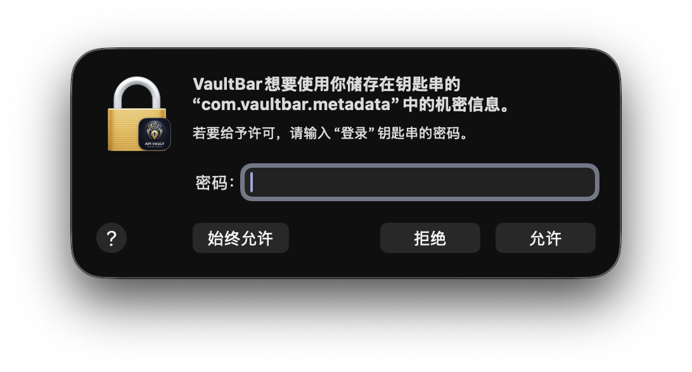
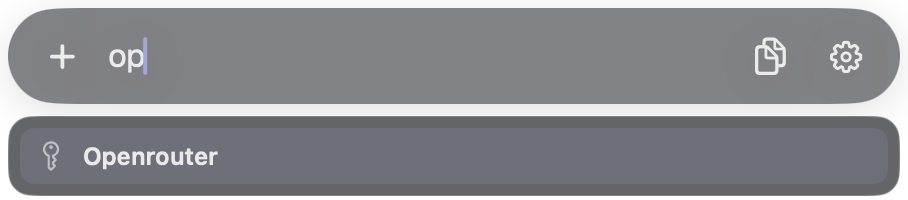
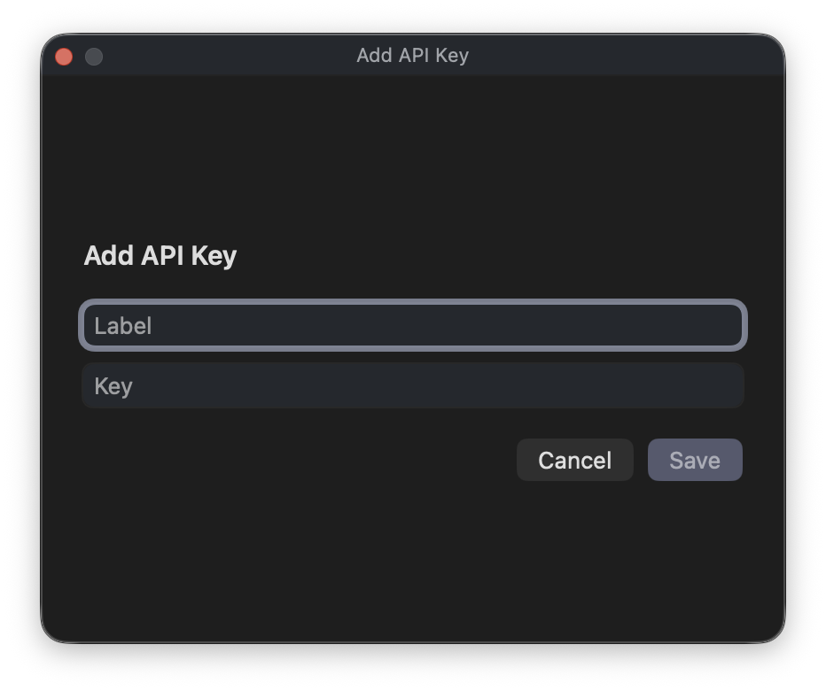
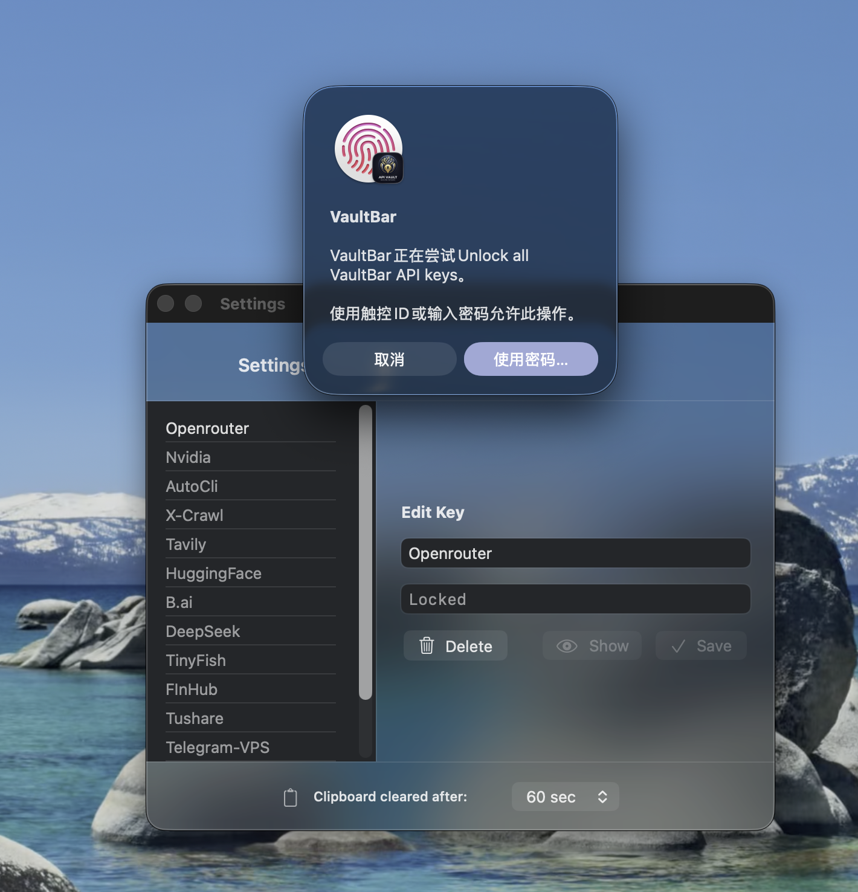

# VaultBar


VaultBar 是一个 macOS 菜单栏 API Key 管理器。它支持搜索、复制、编辑 API Key，数据保存在系统 Keychain 和加密元数据中。

## 下载

如果你只想直接使用，不需要自己编译，可以到 GitHub Releases 下载预编译版本：

[VaultBar v0.3.0](https://github.com/im4saken/vaultbar/releases/tag/v0.3.0)

## 功能

- 菜单栏一键打开搜索栏，快速查找 API Key
- 复制到剪贴板后自动清理
- 每个 Key 可以记录关联网站和备注
- 支持 CSV 批量导入和导出（含明文警告）
- 设置面板里编辑、删除 Key，调整剪贴板清理时间
- 支持锁定和解锁已保存的 Key

## 安装与运行

### 方式一：直接运行

构建并生成可执行 app bundle：

```sh
./scripts/build-app.sh
```

生成结果在：

```text
build/VaultBar.app
```

然后双击打开，或者用命令启动：

```sh
open build/VaultBar.app
```

### 方式二：本地开发

如果你想用 Swift Package 方式编译：

```sh
swift build
```

## 使用教学

### 1. 打开搜索栏

点击菜单栏里的 VaultBar 图标，会弹出搜索栏。第一次启动时，macOS 可能会要求授权。



### 2. 搜索和复制

在搜索框里输入 Key 名称，回车会复制当前选中的 Key。也可以点击结果列表里的条目进行选择。



### 3. 添加 Key

在搜索栏里点击 `+`，会打开新增窗口。填入名称、API Key，可选填写关联网站和备注后保存。



### 4. 管理 Key

打开「设置」可以编辑标题、API/Token、网站和备注，也可以删除已有 Key 或调整剪贴板自动清理时间。

### 5. 锁定和解锁

在设置左上角点击锁头图标，可以解锁查看或编辑 Key。再次点击会重新锁定并清空当前解锁状态。



### 6. 批量导入与导出

设置面板顶部有两个按钮：

- **批量导入**（向下箭头）：弹出一个文本框，把 CSV 内容**粘贴**进去即可批量导入 Key。
- **导出**（向上箭头）：把当前所有 Key 导出成 CSV 文件，保存到「下载」文件夹（`~/Downloads`）。导出前会弹明文警告并要求 Touch ID 解锁，完成后可一键在 Finder 中显示。

CSV 格式（导入粘贴的内容、导出的文件都用这个格式）：

```csv
label,api_key,website,notes
OpenAI,sk-xxxx,openai.com,主账户
Anthropic,sk-ant-xxxx,anthropic.com,"含,逗号的备注"
```

- 推荐 4 列：`label,api_key,website,notes`（导出也用这个格式）
- 兼容旧的 2 列：`label,api_key`（`website` / `notes` 留空）
- 含逗号、双引号或换行的字段需用双引号包裹（RFC 4180）；内部的双引号写成 `""`
- 以 `#` 或 `//` 开头的行会被跳过
- 首行如果是 `label,api_key,...` 会被识别为表头并跳过
- 同名 Key 会作为新条目添加，不会去重

> ⚠️ **关于明文导出**：导出的 CSV 文件包含**未加密**的 API Key。任何能读到这个文件的人都能看到所有密钥。**不要**把它放到 iCloud / Dropbox 等自动同步目录、Git 仓库、聊天工具或公开存储里；使用完毕请妥善删除。导出前应用会通过 Touch ID 再次确认身份。

## 为什么启动时会要求输入密码

VaultBar 把 API Key 存在系统 Keychain 里。启动时需要访问这些 Keychain 条目来读取元数据、恢复已保存的 Key，或者准备 Settings 里的编辑视图。macOS 会在某些情况下要求你输入登录密码或通过系统验证，这是系统在确认“当前应用可以读取这些受保护的数据”，不是 VaultBar 自己保存了额外密码。

如果你刚重启过电脑、刚登录账户，或者 Keychain 还没有解锁，第一次访问时出现密码提示是正常的。

## 说明

- API Key 保存在系统 Keychain。
- 搜索元数据使用加密 JSON 存在 Application Support。
- 本项目是 macOS 菜单栏应用，`LSUIElement = true`。
- 本应用**启用 App Sandbox**，并**禁用网络访问**（`network.client`/`network.server` 均为 false）。即使应用被攻破，sandbox + 无网络也能限制密钥被外传。
- 导出需要写入「下载」文件夹，因此声明了 `com.apple.security.files.downloads.read-write`；导入是粘贴文本，不需要文件访问权限。
- API Key 由系统 Keychain 加密保护，这与是否沙盒无关。

## 项目文件

- `Sources/VaultBar/Security/KeychainHelper.swift`: Keychain 读写
- `Sources/VaultBar/Storage/MetadataStore.swift`: 加密元数据存储
- `Sources/VaultBar/App/KeyRepository.swift`: 搜索、复制、导入逻辑
- `Sources/VaultBar/Window/CapsulePanel.swift`: 菜单栏搜索浮窗
- `Sources/VaultBar/UI/CapsuleSearchView.swift`: 搜索栏界面
- `Sources/VaultBar/UI/SettingsView.swift`: Settings 管理界面
